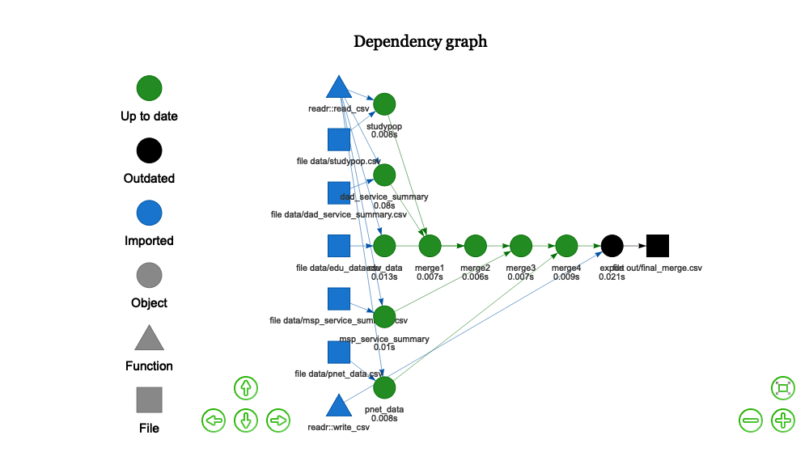
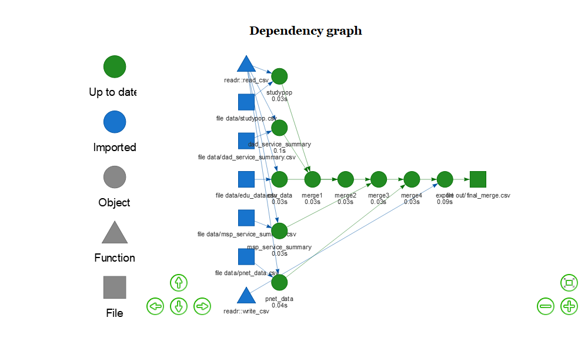

<!-- README.md is generated from README.Rmd. Please edit that file -->

This a repo that is a home for developing a lesson and talk around drake
based
workflows.

# drake-example

<!-- badges: start -->

<a id="devex-badge" rel="Inspiration" href="https://github.com/BCDevExchange/assets/blob/master/README.md"></a>
<!-- badges: end -->

The goal of drake-example is to provide a repo for developing a lesson
or lecture surrounding drake based workflows.

The simple drake workflow outlined at the moment first involves
generating some data:

``` r
library(here)
#> here() starts at C:/_dev/GitHub_repos/drake-example
source(here("generate_cohort_example.R"))
#> Warning: package 'dplyr' was built under R version 3.6.1
#> 
#> Attaching package: 'dplyr'
#> The following objects are masked from 'package:stats':
#> 
#>     filter, lag
#> The following objects are masked from 'package:base':
#> 
#>     intersect, setdiff, setequal, union
#> Warning: package 'readr' was built under R version 3.6.1
```

Then we need to source our respective `.R` files which define the drake
workflow:

``` r
source(here("R/packages.R"))
#> Warning: package 'drake' was built under R version 3.6.1
source(here("R/functions.R"))       
source(here("R/plan.R"))    
```

Then lastly we need to run the plan and visualize our progress. This
typically would all be contained within a `make.R` file:

``` r
plan
#> # A tibble: 10 x 2
#>    target             command                                              
#>    <chr>              <expr>                                               
#>  1 studypop           readr::read_csv(file_in("data/studypop.csv"))       ~
#>  2 dad_service_summa~ readr::read_csv(file_in("data/dad_service_summary.cs~
#>  3 edu_data           readr::read_csv(file_in("data/edu_data.csv"))       ~
#>  4 msp_service_summa~ readr::read_csv(file_in("data/msp_service_summary.cs~
#>  5 pnet_data          readr::read_csv(file_in("data/pnet_data.csv"))      ~
#>  6 merge1             studypop %>% left_join(dad_service_summary)         ~
#>  7 merge2             merge1 %>% left_join(edu_data)                      ~
#>  8 merge3             merge2 %>% left_join(msp_service_summary)           ~
#>  9 merge4             merge3 %>% left_join(pnet_data)                     ~
#> 10 export             readr::write_csv(merge4, file_out("out/final_merge.c~


config <- drake_config(plan)
vis_drake_graph(config)
```

<!-- -->

``` r


make(plan)
#> target dad_service_summary
#> Target dad_service_summary messages:
#>   Parsed with column specification:
#> cols(
#>   name = col_character(),
#>   homeworld = col_character(),
#>   species = col_character()
#> )
#> target studypop
#> Target studypop messages:
#>   Parsed with column specification:
#> cols(
#>   name = col_character(),
#>   gender = col_character()
#> )
#> target edu_data
#> Target edu_data messages:
#>   Parsed with column specification:
#> cols(
#>   name = col_character(),
#>   birth_year = col_double()
#> )
#> target msp_service_summary
#> Target msp_service_summary messages:
#>   Parsed with column specification:
#> cols(
#>   name = col_character(),
#>   hair_color = col_character(),
#>   skin_color = col_character(),
#>   eye_color = col_character()
#> )
#> target pnet_data
#> Target pnet_data messages:
#>   Parsed with column specification:
#> cols(
#>   name = col_character(),
#>   height = col_double(),
#>   mass = col_double()
#> )
#> target merge1
#> Target merge1 messages:
#>   Joining, by = "name"
#> target merge2
#> Target merge2 messages:
#>   Joining, by = "name"
#> target merge3
#> Target merge3 messages:
#>   Joining, by = "name"
#> target merge4
#> Target merge4 messages:
#>   Joining, by = "name"
#> target export

vis_drake_graph(config)
```

<!-- -->
